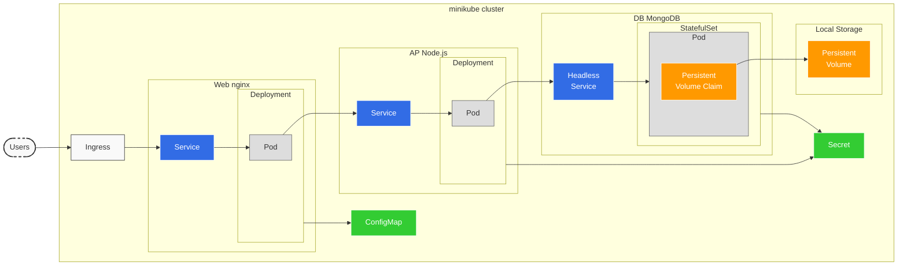

# Webアプリケーション構築 実践

## アーキテクチャ

## **1. デバッグ用イメージ作成** : `08-01`
### 内容
1. Dockerで作成したイメージを実行
2. 実行中コンテナに入る
3. 必要なコマンドが実行可能なことを確認
4. KubernetesでPodを作成
### 手順
1. `Dockerfile`, `mongodb-org-4.0.repo`, `debug-pod.yml`を作成
2. `kubectl apply -f debug-pod.yml`
3. `kubectl exec -it debug -- sh`でpodに入る
4. `jq`, `mongodb`, `ip`コマンドを実行できるか確認

## **2. DBサーバーのイメージ作成** : `08-02`
### 内容
1. DB初期化処理実装
2. イメージ作成
3. コンテナに入って動作確認
### 手順
1. `docker-entrypoint.sh`, `.dockerignore`, `Dockerfile`を実装
2. `docker build -t weblog-db:v1.0.0 .`
3. `docker run -d weblog-db:v1.0.0`
4. `docker container ls`      
5. `docker exec -it vibrant_babbage sh`
6. `mongo`で動作確認
7. `docker container stop vibrant_babbage`
8. `docker container prune`

## **3. DBサーバーの構築 (ストレージ)** : `08-03`
### 内容
1. PersistentVolumeとPersistentVolumeClaimのペアを作成
2. PVCはDB(MongoDB)にあり, PVはhostpathを設定するためLocal Storageにある
### 手順
1. `weblog-db-storage.yml`を作成
2. `kubectl apply -f weblog-db-storage.yml`
3. `kubectl get pv,pvc`

## **4. DBサーバーの構築 (Pod)** : `08-04`
### 内容
1. DBサーバーを構築する
2. Podを立ててPVCと接続させる
### 手順
1. `weblog-db-storage.yml`を持ってくる
2. pv, pvcに加えてPodを実装
3. `kubectl apply -f weblog-db-storage.yml`
4. `kubectl exec -it mongodb -- sh`
5. `mongodb`
6. `show dbs`
7. `exit`でdbから抜ける
8. `exit`でPodから抜ける
9. `kubectl delete -f weblog-db-storage.yml`

## **5. DBサーバーの構築 (Pod + Secret)** : `08-05`
### 概要
- Secretを作成してmongodb内のPodに接続する
1. keyfile (ランダム文字列) を作成
2. Secretリソースを作成
3. SecretリソースのYAMLを取得
4. `weblog-db-pod.yml`へマージ
5. Secretリソースを削除
### 手順
1. `openssl rand -base64 1024 | tr -d '\r\n' | cut -c 1-1024 > keyfile`で文字列生成
2. `kubectl create secret generic mongo-secret --from-literal=root_username=admin --from-literal=root_password=Passw0rd --from-file=./keyfile`でsecret作成
3. `kubectl get secret/mongo-secret -o yaml`でSecretの内容をyamlで得る
    - これによりSecretのyamlファイルには暗号化された文字列が記述される
    - 実際に環境変数に入る値はSecretのyamlファイルで記述された文字列をdecodeしたもの
4. `weblog-db-storage.yml`を更新
5. `kubectl apply -f weblog-db-storage.yml`
6. `kubectl exec -it mongodb -- sh`で入る
7. `mongo`でdbに入る
8. `show dbs`を実行するとエラーになる
9. `use admin`でdbをadminに変更
10. `db.auth("admin", "Passw0rd")`でログイン
11. `show dbs`で閲覧できる

## **6. DBサーバーの構築 (StatefulSet)** : `08-06`
### 概要
- StatefulSetを利用することでレプリケーションを実現
  - レプリケーションとは読み書き可能なプライマリと読み取り可能なセカンダリから構成される冗長化されたDBのこと
1. PV, Secret, StatefulSetを作成
2. 作成したPodに入る
3. MongoDBへ接続
4. 設定したユーザー名/パスワードで認証
5. DB一覧を表示
### 手順
1. `weblog-db-statefulset.yml`でStatefulSetを定義してPodをStatefulSetのtemplateに移動
2. `kubectl applpy -f weblog-db-statefulset.yml`
3. `kubectl get pod`で3個(replicasでしたいした個数)作成される
4. `kubectl exec -it mongodb-0 -- sh`
5. `mongo`, `use admin`, `db.auth("admin", "Passw0rd")`
6. `exit`, `exit`
7. `kubectl delete -f weblog-db-statefulset.yml`
8. `persistentvolume/volume-00`を02まで

## **7. DBサーバーの構築 (HeadlessService)** : `08-07`
## 概要
- レプリカセットの初期化を行う
  - mongodbにおけるレプリカセットの初期化は`rs.initiate()`メソッドで初期化する
  - Pod名+HeadlessService名で名前解決できる
1. PV, Secret, StatefulSet, Serviceを作成
2. 作成したPodへ入る
3. MongoDBを初期化
4. レプリカセットを構築できていることを確認
## 手順
- `weblog-db-statefulset.yml`にService作成
- `kubectl apply -f weblog-db-statefulset.yml`
- `kubectl exec -it mongo-0 -- sh`
- `mongo`
- `use admin`, `db.auth("admin", "Passw0rd")`
- `rs.initiate({ _id: "rs0", members: [ { _id: 0, host: "mongo-0.db-svc:27017" }, { _id: 1, host: "mongo-1.db-svc:27017" }, { _id: 2, host: "mongo-2.db-svc:27017" } ] })`
- `rs.status()`
  - primaryまたはsecondaryになればレプリカセットの初期化終わり
- `show dbs`が実行できればok

## **8. DBサーバーの構築 (初期化) ** : `08-08`
### 概要
- `08-07`のレプリカセットを起動したまま
1. デバッグ用Podを起動
2. 初期化スクリプトをデバッグ用Podへコピー
3. デバッグ用Podへ入る
4. MongoDBへ接続してプライマリを確認して切断
5. 初期化スクリプトを修正
6. 初期化スクリプトを実行
7. いずれかのMongoDBに接続してデータが入ったことを確認
### 手順
1. `kubectl apply -f debug-pod.yml`
2. `kubectl exec -it debug -- sh`
3. `mongo mongo-0.db-svc`, `use admin`, `db.auth("admin", "Passw0rd")`
4. primaryを探す
5. primaryのmongo podに入って`sh init.sh`でデータ初期化
6. `show dbs`, `use weblog`, `show collections`, `db.posts.find().pretty()`などで確認

## **9. APサーバーのイメージ作成** : `08-09`
### 概要
1. MongoDBのプライマリ確認
2. MongoDBに対するService, Endpointsを作成
3. Dockerで作成したイメージを実行
4. 作成したNode.jsアプリケーションコンテナへ接続
5. MongoDB接続用Service, Endpointsを削除
### 手順
- `docker build -t weblog-app:v1.0.0 .`
- `kubectl apply -f weblog-db-service.yml`
- `docker run -e MONGODB_USERNAME="user" -e MONGODB_PASSWORD="welcome" -e MONGODB_HOSTS="host.docker.internal:32717" -e MONGODB_DATABASE="weblog" -e MONGODB_AUTH_SOURCE="weblog" -d -p 8080:3000 weblog-app:v1.0.0`
- `curl localhost:8080`

## **10. APサーバーの構築 (Pod + Secret) ** : `08-10`
### 概要
1. Secret, Podを作成
2. デバッグPodを作成して入る
3. APサーバーPodへ接続確認
### 手順
1. `kubectl apply -f weblog-app-pod.yml`
2. `kubectl get pod -o wide`
3. `kubectl exec -it debug -- sh`
4. `curl 10.1.0.71:3000`でdebug用podからAPサーバーへアクセス
5. `kubectl delete pod/nodeapp`でpodだけ削除してSecretは残す

## **11. APサーバーの構築 (Deployment) ** : `08-11`
### 概要
1. Secret, Deploymentを作成
2. デバッグPodを作成して入る
3. APサーバーPodへ接続確認
### 手順
- `kubectl apply -f weblog-app-deploy.yml`
- `kubectl get pod -o wide`でdeployment経由で作成した3つのpodのIPアドレスを取得
- `kubectl exec -it debug -- sh`
- `curl 10.1.0.72:3000`,`curl 10.1.0.73:3000`,`curl 10.1.0.74:3000`でdeployment経由で作成されたすべてのpodへのアクセス確認
- `kubectl delete deploy/nodeapp`

## **12. APサーバーの構築 (Service) ** : `08-12`
### 概要
1. Secret, Deployment, Serviceを作成
2. デバッグPodを作成して入る
3. APサーバーへService経由で接続
4. APサーバーのいずれかにログ出力されていることを確認
### 手順
1. `kubectl apply -f weblog-app-service.yml`
2. `kubectl exec -it debug -- sh`
3. `curl http://app-svc:3000`
    - このときクラスタ内部からService層経由でPodにアクセスしている
    - このPodはDeploymentで複数作成されたものでServiceはロードバランサーの役割
4. `exit`で抜けて3つのPodのlogをみる
5. `kubectl logs nodeapp-548b5c6bf6-t7z6r`などで3つのログをみると1つのPodのみアクセスログがあるはず
    - `[2025-02-11T15:12:23.196] [INFO] access - ::ffff:10.1.0.70 - - "GET / HTTP/1.1" 200 1404 "" "curl/7.29.0"`
6. ロードバランサーの役割を果たしていることを確認できた

## **13. Webサーバーのイメージ作成** : `08-13`
### 概要
1. APサーバーへアクセスするServiceサービスを作成
2. Webサーバーコンテナ起動
3. 外部からブラウザでアクセスして画面確認
### 手順
1. `kubectl apply -f weblog-app-service.yml`
2. `docker run -e APPLICATION_HOST=localhost:30000 -p 8080:80 -d weblog-web:v1.0.0`
3. `curl localhost:30000`

## **14. Webサーバーの構築 (Pod)** : `08-14`
### 概要
- ゴールはConfigMap, Deployment, Serviceを作成
1. 今回は上記のためにまずはPodを作成
1. 作成したWebサーバーPodのIPアドレスを確認
2. デバッグPodを作成して入る
3. Webサーバーへ接続
4. 接続したWebサーバーにアクセスログがあることを確認
### 手順
- `kubectl apply -f weblog-web-pod.yml`
- `kubectl get pod -o wide`で今回作成したPodのIP取得
- `kubectl exec -it debug --sh`
- `curl IP`
- `exit`してAPサーバーの3つのPodのlogを順番に表示するとどれか1つにアクセスログがある

## **15. Webサーバーの構築 (Pod + ConfigMap)** : `08-15`
### 概要
1. ConfigMap, Podを作成
2. WebサーバーPodに入ってConfigMapを利用していることを確認
3. WebサーバーPodのIPアドレスを確認
4. デバッグPodを作成して入る
5. WebサーバーPodへ接続確認
### 手順
1. `kubectl apply -f weblog-web-pod+configmap.yml`
2. `kubectl exec -it nginx -- sh`
3. `cat /etc/nginx/nginx.conf`
4. `exit`
5. `kubectl exec -it debug -- sh`
6. `curl IP`

## **16. Webサーバーの構築 (Deployment)** : `08-16`
### 概要
1. ConfigMap, Deploymentを作成
2. WebサーバーPodのIPアドレスを確認
3. デバッグPodを作成して入る
4. WebサーバーPodいずれかへ接続確認
### 手順
1. `kubectl apply -f weblog-web-deploy.yml`
2. `kubectl get pod -o wide`
3. `kubectl exec -it debug -- sh`
4. `curl curl 10.1.0.84`
5. `curl curl 10.1.0.85`
6. `curl curl 10.1.0.86`
 
## **17. Webサーバーの構築 (Service)** : `08-17`
### 概要
### 手順

## **18. Webサーバーの構築 (Ingress)** : `08-18`
### 概要
### 手順